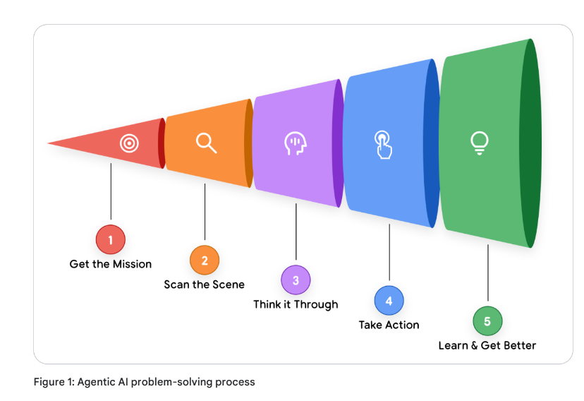
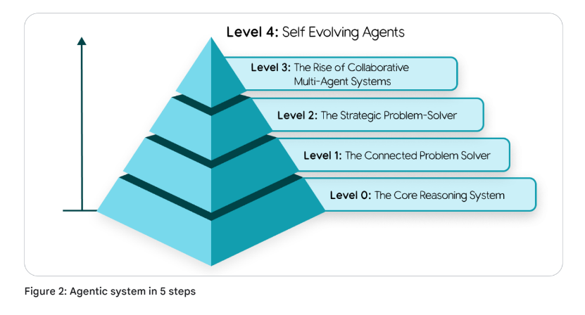
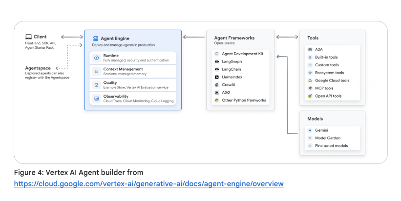

# Notes on Day-1
## Topics
- Introduction to AI Agents
- Taxonomy of Agent Capabilities 
- Need for Agent Ops for reliability and governance
- Importance of agent interoperability & security (through identity and constrained policies)

## CodeLabs
- Build 1st AI Agent
    - Use ADK
    - Use google search for live results 
- Build 1st multi-agent system
    - Create team of specialized agents
    - Explore different architecture patterns

## Assignment
Complete the Unit 1 – “Introduction to Agents”:
- [x] Listen to the summary podcast episode for this unit, created by NotebookLM.
- [x] To complement the podcast, read the “Introduction to Agents” whitepaper
- [] Complete these codelabs on Kaggle:
    - [] Build your first agent using Gemini and ADK.
    - [] Build your first multi-agent systems using ADK.
    - [] Make sure you phone verify your Kaggle account before starting, it's necessary for the codelabs.
    - [] We also have a troubleshooting guide for the codelabs. Be sure to check there for solutions to common problems.
    - [] Want to have an interactive conversation? Try adding the whitepapers to NotebookLM.

### Summary Podcast Episode
- Link to podcast episode: https://www.youtube.com/watch?v=zTxvGzpfF-g

- Autonomous AI Agents
    - Plan, Act, Solve complex problems 
    - Over multiple steps
    - Without holding their hands
    - Autonomy: Execute actions in real work to go. 

- Agent Anatomy 
    - 3 core parts
    - **model**, the brain 
        - model = LLM 
        - the core langugage model, the reasoning engine
        - key responsibilties: 
            - managing context 
            - i.e., decides the input matters for the next though process
        - model thinks, but needs tools to perform actions
        - crucial responsibility:
            - model reasons about which tool is needed for current step of the plan

    - **tools**, the hands
        - connections of outside world or internal systems 
        - Ex: APIs, code functions, ways to access DBs, vector scores
    - **orchestration layer**, the conductor pulling all together
        - calls the tool decided by the model
        - manages: 
            - operational loop
            - keep track of memory or state
            - executing the reasoning strategy, like chain of thought or react, common for agents
    - Each step of the loop: Think, Act, Observe cycle.
    
- Complexity of Agents 
    - **Level 0:**
        - `Baseline`
        - LLM on it's own
        - No tools
        - Knows on what it's trained on. 
        - Can tell about history Maybe, explain a concept.
        - Can't tell about score of last night game!
    - **Level 1:**
        - `The connected problem solver`
        - Tools come in. 
        - connect reasoning engine to tools. 
        - those hands can:
            - search API, DBs, 
            - Answer score questions
        - conects to the world.
    - **Level 2:**
        - `The startegic problem solver`
        - Moving beyond simple tasks, hanlde more complex multi-arch tasks. 
        - Key skill: **context engineering**
            - Agent gets smart after crafting the input for every step
        - Example: find coffee shops with rating >4.0 halfway between two address
            - 1st maps tool to calculate the actual halfway co-oridinates
            - then, takes those results (coordinates or address halfway), uses it to craft a specific query to get coffee shops with rating >4.0 in that neighbourhood nearby. 
        - Actively managing it's own content to give more relevant results and avoid noise. 
    - **Level 3:**
        - `Collaborative multi-agent system`
        - Team of specialists
        - Agents treat other agents as tools
        - Example: A project manager agents delegates tasks to other specialized agents, maybe, market research agent or data analyst agent. 
        - What's the difference? Agent API call vs complex function call
            - The difference is the autonomy of the agent being called. 
            - Agent-to-Agent goal deligation 
    - **Level 4:**
        - `The Self-Evolving System`
        - Frontier now. 
        - System can identify gaps in it's capabilities
            - it knows what it doesn't know or what it can't do
            - fixes it

- Putting Agents in Production? 
    - Model selection 
        - look beyond benchmark scores
        - model routing 
    - Function calling 
        - Tells what tool does and what it needs
        - Structured communication
    - Orchestration layer
        - setting operating rules 
        - like prompting rules 
        - Memory usage: short and long term memory
    - Testing and Debugging 
        - Evaluate quality 
        - Use a "Judge" - Use more powerful Agent to judge
        - If fails, observability is important
            - pinpoint where things were wrong 
    - Security and Scaling 
        - More utility = more risk 
        - Simple rules enforced by calls 
            - AI based gaurdlines 
            - Agent own identify 
            - Own, secure, verifiable identity
        - Single point of control is needed for L-3/L-4
    - How do they learn and improve? 
        - Logs, traces, updated policies
        - improve context engineering
        - future is simulated enviroment. 

- Building Successful Agents 
    - Not just a powerful model thing
    - Agent is combination of:
        - Model for reasoning 
        - Tools for action 
        - Orchestration layer managing the loop
    - Success of Agent 
        - Engineering rigour around it
        - The architecture 
        - The governance 
        - Security 
        - Testing
        - Observability 
        - PROD ready !!!!

### Introduction to Agents - Whitepaper
- Link to whitepaper: https://www.kaggle.com/whitepaper-introduction-to-agents
- `Agents are natural evolution of LLM, made useful in software`. 

- For years, focus was on **models** that excel at passive, discrete tasks:
    - anwering a question
    - translating text
    - generating an image from prompt
    - this paradigm needs constant human direction at every step 

- New Frontier - "AI Agents"
    - Moving towards "Autonomous problem solving and task execution"
    - What is an AI Agent? 
        - Not a simple static model in AI workflow
        - it's a complete application , making plans and taking actions to achieve goals.
        - Combines LLMs ability to reason with practical ability to act, allowing it to handle complex tasks. 
        - Critically, Agents can work on their own. 

- This documents are `formal guide` for: 
    - Developers
    - Architects
    - Product Leaders (POCs to Production Grade Agentic Systems)
    - New generation agentic systems: can reason, act, and observe to accomplish goals. 

#### Core Anatomy 
- `AI Agent` is combination of 3 essential parts
    - **Model - for reasoning**
        - The Brain 
        - Core langugae model - LM or foundational model = central reasoning engine: 
            - to process information
            - evaluate options 
            - make decisions 
        - Types of model 
            - General pupose 
            - fine-tuned
            - multimodal
        - Ultimate curator of Input context window for LM
    - **Tools - for actions**
        - The Hands
        - Connects Agent's reasoning to outside world
        - Enables actions beyond text generation
        - An Agentic System allows: 
            - LM to plan which tools to use 
            - execute the tool
            - puts the tools results to context window for next LM call. 
    - **Orchestration layer - for governance** 
        - The Nervous System 
        - The governing process that manages the agent's operational loop
        - It handles:
            - Planning
            - memory (state)
            - reasoning strategy execution
        - Uses prompting framework and reasoning techniques (like, Chain-of-Thought or ReAct)
        - Breaks down complex task into multiple simple steps and decide when to think vs use tool. 
        - Responsible to give agent memory to "remember"
    - **Deployment**
        - The body and legs
        - PROD deployment  is reliable and accessible service
        - Needs hosting agent on secure, scalable server, and interating it with essential production services for monitoring, logging and managment. 
        - After being deployed, agents can be accessed:
            - by user via GUI
            - by other agents via A2A protocol

    - Prompt/Context Engineering 
        - LLMs capacity to anything vs do a specific thing reliably and perfectly. 
        - For Debugging, `Agent Ops` is crucial.

#### Agentic Problem Sovling Process

- Agent operates on a continous, cyclical process to achieve its objective. 5 fundamental steps as discussed in `Agentic System Design` book: 
    - 1. Get the Mission 
        - Process in initiated by specific, high-level goal
        - Provided by user or an automated trigger
    - 2. Scan the Scene
        - Agent perceives the env. to get context
            - Orchestration layer accessing it's resources 
    - 3. Think it Through 
        - Agent's core think loop, driven by reasoning model
        - Agent analyzes the Mission (Step 1.) against the scene (Step 2.) and devises a plan 
        - Not single, but, chain of reasonings
    - 4. Take Action 
        - Orchestration layer, executes the 1st concrete step of the plan 
        - By selecting and invoking appropriate tool.
    - 5. Observe and Iterate
        - Agent observe outcomes of the action
        - Information is added to context or memory

#### A Taxonomy of Capabilites

- 5 Levels: 
    - Level 0: The Core Reasoning System
    - Level 1: The Connected Problem-Solver
    - Level 2: The Strategic Problem-Solver
    - Level 3: The Collaborative Multi-Agent System
    - Level 4: The Self-Evolving System

#### Architecture Design 
- Practical design considerations for each component, from model selection to tool implementation
- 3 Core architecture: 
    - Model: The “Brain” of your AI Agent
    - Tools: The "Hands" of your AI Agent 
        - Few main types of agent builders
        - `Retrieving Information: Grounding in Reality`
            - Most foundational tool 
            - Accessing up-to-date information: 
                - RAG gives ability to query external knowledge, often stored in vector DB or Knowledge Graphs
                - internal company documents to web knowledge via Google search
            - For structured data, NL2SQL tools 
            - By looking things before answering reducing hallucinations. 
        - `Executing Actions: Changing the World`
            - True power: from reading to doing 
            - APIs and functions as tools, agents can send emails, scheudule a meeting, or update customer record
            - Agent can alos use HITL (Human in the Loop) in workflow for confirmation. 
        - `Function Calling: Connecting Tools to your Agent`
            - For function calling, agent needs: secure connection, and clear instruction, orchestration
            - Standards link OpenAPI specification gives: 
                - an agent  structured contract - tools purpose, req. parameters, and its expected reponse
                - For simple discovery, Model Context Protocal (MCP) is popular
                - Gemini with native google search, function invocation happens as part of LP call. 
    - The Orchestration Layer

#### Building for Production 
- Agent Ops disciple needs to evaluate, debug, secure, and scale agentic systems - single system to fleet with enterprise governance. 
- ADK - Agent Development Kit
    - deep control 
    - customizability 
    - integration capabilities
- Vertex AI Agent Engine
    - https://cloud.google.com/vertex-ai/generative-ai/docs/agent-engine/overview
    - Agent Engine 
    - Agent Frameworks 
    - Tools 
    - Models 

- Agent Ops 
    - disciplined, structured approach to managing this new reality.
    - transition from traditional, deterministic software to stochastic, agentic system needs new operational philosophy
    - agent's response is probabilistic by design.
    - natural evolution of DevOps and MLOps
    - challenges of building, deploying, and governing AI agents, turning unpredictability from a liability into a managed, measurable,
and reliable feature.
    - Deep-dive on: 
        - Measure What Matters: Instrumenting Success Like an A/B Experiment
        - Quality Instead of Pass/Fail: Using a LM Judge
        - Metrics-Driven Development: Your Go/No-Go for Deployment
        - Debug with OpenTelemetry Traces: Answering "Why?"
        - Cherish Human Feedback: Guiding Your Automation
        - Agent Interoperability

### Review Agents examples (TO DO)
- TO DO 

### Conclusions
- Formal framework for building agents, prod ready architectures 
- Agent into 3 components: Model, Tools, Orchestration Layer 
- Continuous "Think, Act, Observe" loop
- 5 levels of agents based on complexity
- We should guide, constrain and debug an autonomous entity 
- Success is not just in initial prompt alone; 
    - in the engineer rigor applied to entire system; 
    - in robust tool contracts; 
    - resilient error handling; 
    - sophisticated context management; 
    - comprehensive evaluation